# Уроки программирования по Lazarus

#### **Примеры** - Исходники плейлиста ["Примеры на Lazarus"](https://www.youtube.com/watch?v=74ZoM656uHE&list=PLaHMNOpHDYwqLUaunYysVTQjXa8sErVrX)

[№1. MemoReplace](Примеры/№1.%20MemoReplace) 

|[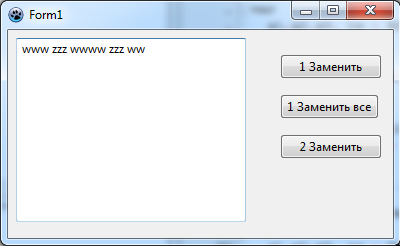](Примеры/№1.%20MemoReplace) | [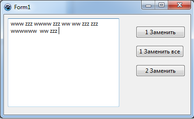](Примеры/№1.%20MemoReplace) |
| ----: | :---- |

[№2. Sender](Примеры/№2.%20Sender)

|[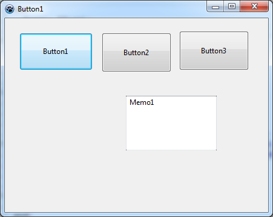](Примеры/№2.%20Sender) | [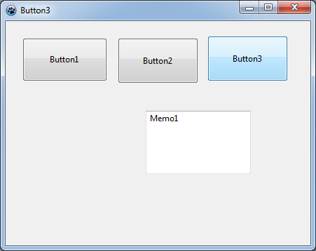](Примеры/№2.%20Sender) |
| ---- | ---- |

[№3. NumberGames](Примеры/№3.%20NumberGues)

|[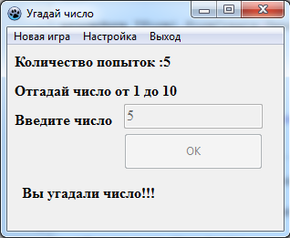](Примеры/№3.%20NumberGues) | [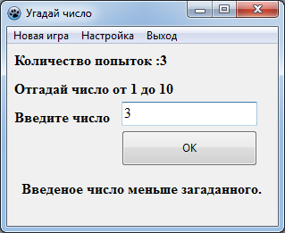](Примеры/№3.%20NumberGues) |
| ---- | ---- |

[№4. Random](Примеры/№4.%20Random)

|[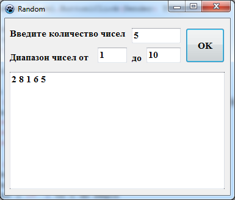](Примеры/№4.%20Random) | [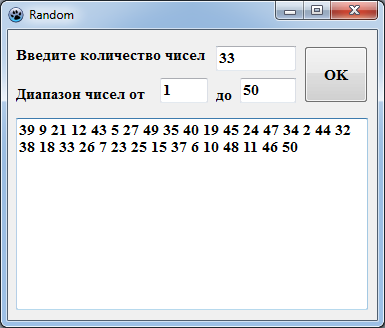](Примеры/№4.%20Random) |
| ---- | ---- |

[№5. Racing](Примеры/№5.%20Racing) 

|[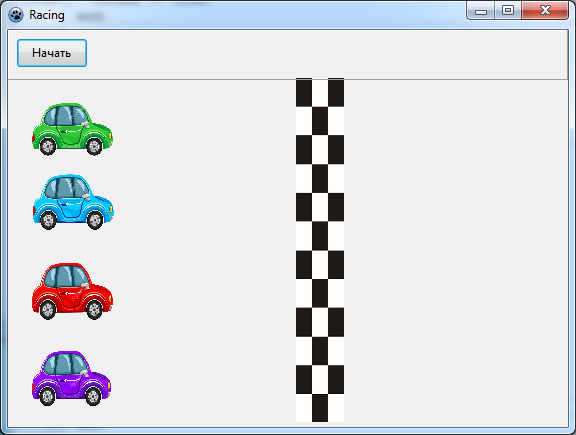](Примеры/№5.%20Racing)  | [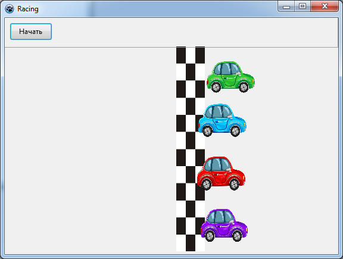](Примеры/№5.%20Racing) |
| ---- | ---- |

[№6. Racing №2](Примеры/№6.%20Racing) 

|[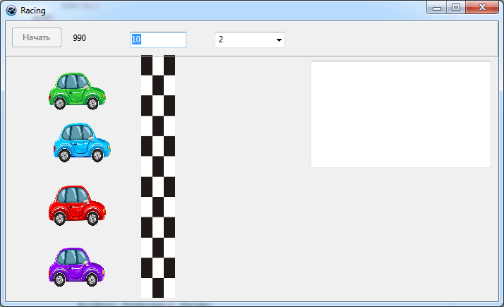](Примеры/№6.%20Racing)  | [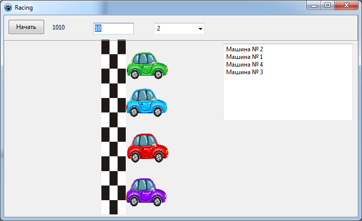](Примеры/№6.%20Racing) |
| ---- | ---- |

[№7. LasPassword](Примеры/№7.%20LasPassword) 

|[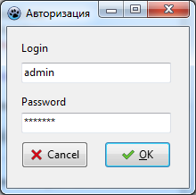](Примеры/№7.%20LasPassword)  | [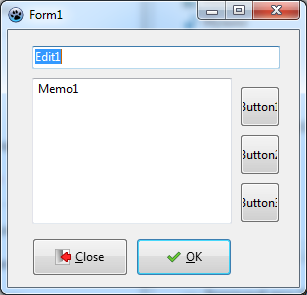](Примеры/№7.%20LasPassword) |
| ---- | ---- |

[№8. Игра Snake2D](Примеры/№8.%20OpenGL%20Snake2D) 

|[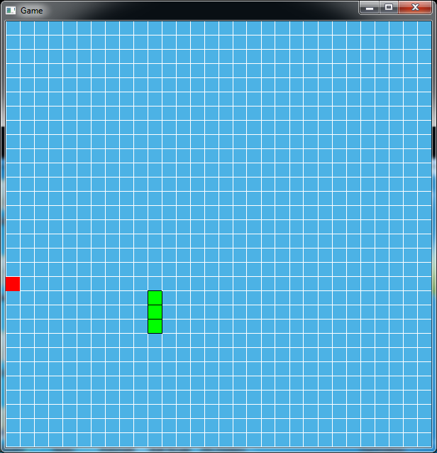](Примеры/№8.%20OpenGL%20Snake2D) | [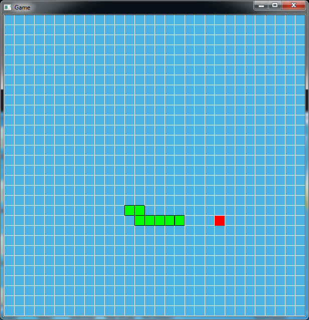](Примеры/№8.%20OpenGL%20Snake2D) |
| ---- | ---- |

[№9. Сatch a mole](Примеры/№9.%20Сatch%20a%20mole) 

|[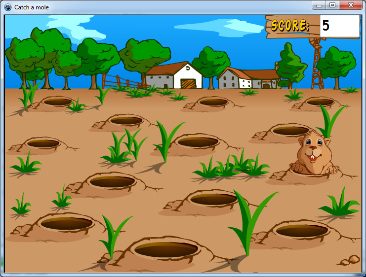](Примеры/№9.%20Сatch%20a%20mole)  | [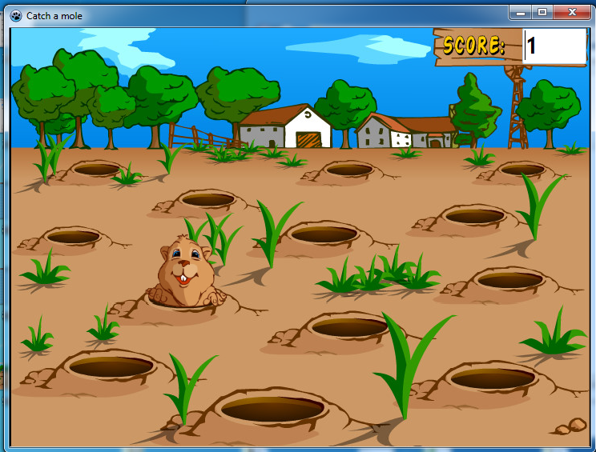](Примеры/№9.%20Сatch%20a%20mole) |
| ---- | ---- |

[№10. Stopwatch](Примеры/№10.%20Stopwatch) 

|[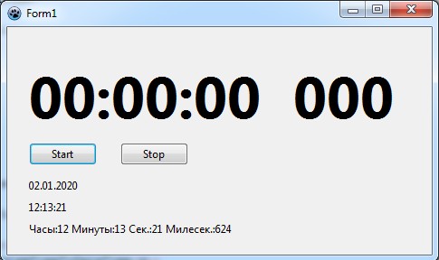](Примеры/№10.%20Stopwatch) | [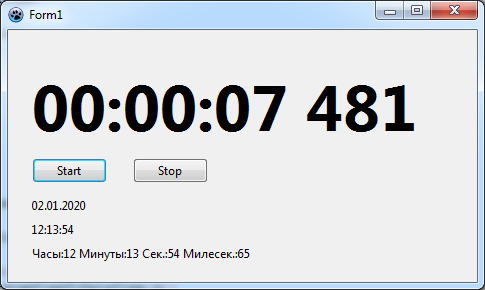](Примеры/№10.%20Stopwatch) |
| ---- | ---- |

[№11. Tic-Tac-Toe](Примеры/№11.%20XO) 

|[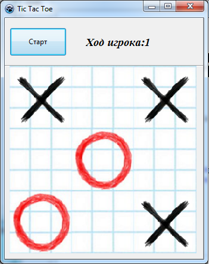](Примеры/№11.%20XO) | [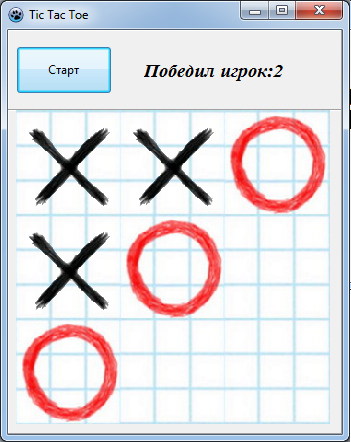](Примеры/№11.%20XO)  |
| ---- | ---- |

#### **Программы** - Исходники плейлиста ["Пишем программы на Lazarus"](https://www.youtube.com/watch?v=btO9NjFDXu4&list=PLaHMNOpHDYwrhqasBmwEJqjEPI8oMR45s)

[№1. Калькулятор](Программы/Калькулятор)

|  |  |
| ----: | :---- |

[№2. Простой текстовый редактор](Программы/Простой%20текстовый%20редактор) 

|  |  |
| ----: | :---- |

[№3. Программа-тест](Программы/Программа-тест) 

|  |  |
| ----: | :---- |

[№4. Программа "Каталог книг"](Программы/Каталог%20книг) 

|   |  |
| ----: | :---- |

 

