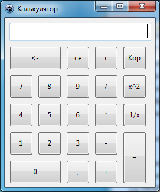
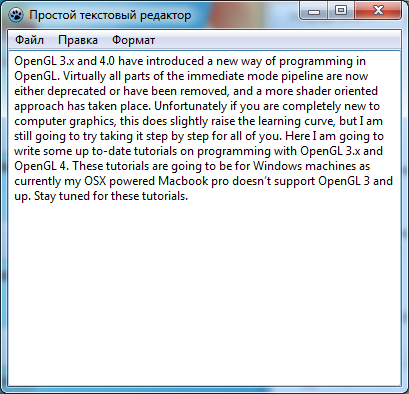
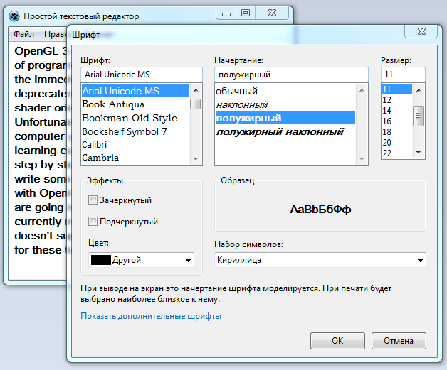
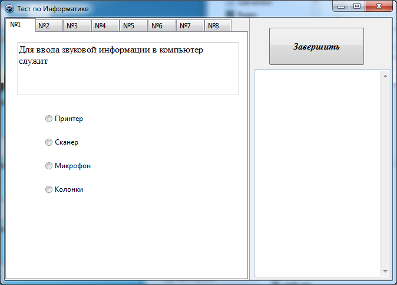
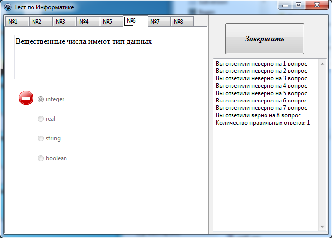
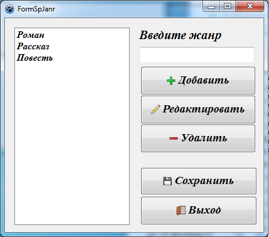

# Уроки программирования по Lazarus

#### **Примеры** - Исходники плейлиста ["Примеры на Lazarus"](https://www.youtube.com/watch?v=i9MHZRlUluE&list=PLaHMNOpHDYwrqReYSHzq9zqocgU7RpqT-)

[№1. MemoReplace](http://localhost/) 

|  |  |
| ----: | :---- |
| | 2222 |

[№2. Sender](http://localhost/)
| 1111 | 2222 |
| ---- | ---- |

[№3. NumberGames](http://localhost/)
| 1111 | 2222 |
| ---- | ---- |

[№4. Random](http://localhost/)
| 1111 | 2222 |
| ---- | ---- |

[№5. Racing](http://localhost/) 
| 1111 | 2222 |
| ---- | ---- |

[№6. Racing №2](http://localhost/) 
| 1111 | 2222 |
| ---- | ---- |

[№7. LasPassword](http://localhost/) 
| 1111 | 2222 |
| ---- | ---- |

[№8. Игра Snake2D](http://localhost/) 
| 1111 | 2222 |
| ---- | ---- |

[№9. Сatch a mole](http://localhost/) 
| 1111 | 2222 |
| ---- | ---- |

[№10. Stopwatch](http://localhost/) 
| 1111 | 2222 |
| ---- | ---- |

[№11. Tic-Tac-Toe](http://localhost/) 
| 1111 | 2222 |
| ---- | ---- |

#### **Программы** - Исходники плейлиста ["Пишем программы на Lazarus"](https://www.youtube.com/watch?v=btO9NjFDXu4&list=PLaHMNOpHDYwrhqasBmwEJqjEPI8oMR45s)

[№1. Калькулятор](Программы/Калькулятор)

|  |  |
| ----: | :---- |

[№2. Простой текстовый редактор](Программы/Простой%20текстовый%20редактор) 

|  |  |
| ----: | :---- |

[№3. Программа-тест](Программы/Программа-тест) 

|  |  |
| ----: | :---- |

[№4. Программа "Каталог книг"](Программы/Каталог%20книг) 

|   |  |
| ----: | :---- |

 

